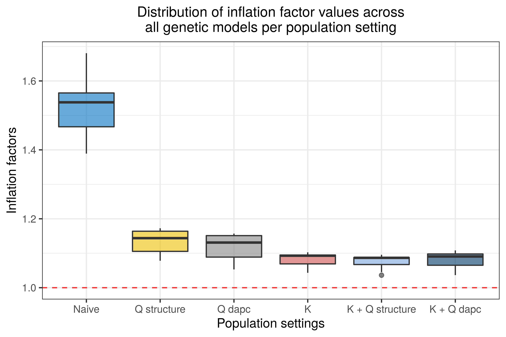

Genome-Wide Association Analysis with GWASpoly
================
Olivia Angelin-Bonnet
June 29, 2022

``` r
theme_set(theme_bw())
theme_update(plot.title = element_text(hjust = 0.5),
             legend.position = "bottom",
             text = element_text(size = 16))
```

## Data path

``` r
samples_info_file = here("data/samples_info.csv")
genotype_file = here("genomics_data_preprocessing/processed_data/gwaspoly_input.csv")
phenotype_file = here("genomics_gwas/processed_data/pheno_df_trans.csv")

structure_file = here("genomics_population_structure/processed_data/STRUCTURE_samples_coord.csv")
dapc_file = here("genomics_population_structure/processed_data/dapc_grp_membership.csv")
```

``` r
samples_info = read_csv(samples_info_file, show_col_types = FALSE) %>% 
  mutate(other_parent = case_when(str_detect(Mum, "(Crop20)|(1335_8)") ~ Dad,
                                  str_detect(Dad, "(Crop20)|(1335_8)") ~ Mum)) %>% 
  replace_na(list(other_parent = "Unknown"))
```

## Creating the phenotype file

We need to add to the phenotype file the covariates to use in the GWAS
analysis, i.e. the posterior membership probabilities obtained with
STRUCTURE and DAPC.

``` r
structure_res = read_csv(structure_file, show_col_types = FALSE) %>% 
  mutate(Sample = str_remove(Sample, "_\\w{3}$"))
dapc_res = read_csv(dapc_file, show_col_types = FALSE) %>% 
  mutate(Sample = str_remove(Sample, "_\\w{3}$"))

phenotypes_df = read_csv(phenotype_file, show_col_types = FALSE)
```

``` r
pheno_popstruct_df = phenotypes_df %>% 
  left_join(structure_res, by = "Sample") %>% 
  left_join(dapc_res, by = "Sample")

phenotype_popstruct_file = here("genomics_gwas/processed_data/phenotypes_popstruct.csv")
write_csv(pheno_popstruct_df, phenotype_popstruct_file)
```

## Genotype file

The problem is that currently the sample IDs in the genotype file
contain a suffix relevant to the genotyping process. We’ll create a copy
of the file in which these suffixes are removed, except for the samples
with several replicates (i.e. the parents, doesn’t matter as they don’t
have phenotype information).

``` r
geno_df_temp = read_csv(genotype_file, show_col_types = FALSE)
new_colnames = str_remove(colnames(geno_df_temp), "_\\w{3}$")
names(new_colnames) = colnames(geno_df_temp)
dupls = unique(new_colnames[duplicated(new_colnames)])
new_colnames[new_colnames %in% dupls] = names(new_colnames)[new_colnames %in% dupls]

colnames(geno_df_temp) = new_colnames

new_geno_file = here("genomics_gwas/processed_data/gwaspoly_input_samplenames.csv")
write_csv(geno_df_temp, new_geno_file)

rm(geno_df_temp)
```

## Loading the genotype and phenotype data

``` r
data <- read.GWASpoly(ploidy = 4,
                      geno.file = new_geno_file,
                      pheno.file = phenotype_popstruct_file,
                      format = "numeric",
                      n.traits = 1,
                      delim = ",")

save(data, file = here("genomics_gwas/processed_data/data.RData"))
```

## Computing the kinship matrix (K model)

`GWASpoly` allows to control for population structure via a random
polygenic effect (the K model). For that, a covariance matrix
proportional to *MM^T*. Using all markers to compute the covariance
matrix leads to a loss of power, therefore it is preferred to use the
leave-one-chromosome-out (loco) method to compute the covariance matrix.

``` r
data_K = set.K(data, LOCO = TRUE, n.core = 3)

save(data_K, file = here("genomics_gwas/processed_data/data_K.RData"))
```

We also set up the data to run a model with no K matrix:

``` r
## Setting up the models without the K matrix
samples = data@pheno$Sample

noK = matrix(0, 
             nrow = length(samples),
             ncol = length(samples),
             dimnames = list(samples, samples))
diag(noK) = 1
data_noK = set.K(data, K = noK)

save(data_noK, file = here("genomics_gwas/processed_data/data_noK.RData"))
```

## Running GWASpoly

In this section we will perform a GWAS analysis for each phenotype.
There are different ways to incorporate population structure and
individual relatedness in the model, so we will compare the following
settings (referred to in this analysis as ‘population setting’),
according to Sharma *et al.* (2018) [^1]:

-   The naive model: the analysis is performed with accounting for
    individual relatedness (kinship matrix K set to a matrix of zeros
    with diagonal elements set to 1) nor population structure (no
    population structure membership used as covariates);

-   The K only model: the analysis only accounts for individual
    relatedness by computing the kinship matrix as the realised
    relationship matrix *K=MM^T* [^2], where *M* is the genotype matrix
    (with *n* rows and *m* columns if *n* is the number of samples and
    *m* the number of markers);

-   The Q only model: the analysis only accounts for population
    structure by integrating the subpopulation membership of each sample
    as a covariate in the analysis. We computed the population structure
    using two methods, namely STRUCTURE and DAPC, so we repeat this
    model by using the population membership computed with each of these
    methods. We thereafter distinguish between the two population
    structure information by using the notation *Q_STRUCTURE* for the
    analysis that uses the result of STRUCTURE, and *Q_DAPC* for the
    analysis that uses the result of DAPC;

-   The K+Q model: the analysis accounts for both individual relatedness
    and population structure, by using the kinship matrix and
    integrating the samples subpopulation membership as covariates.
    Again, we run this analysis with the population structure inferred
    with STRUCTURE (*K + Q_STRUCTURE* model) and with the population
    structure inferred with DAPC (*K + Q_DAPC* model).

In addition to the population setting, the GWAS analysis can be
performed using one of eight genetic models, that each uses a different
model for the marker effect on the phenotype:

-   `General`: there are no constraints on the effects of the different
    dosage levels of a marker on the phenotype;

-   `additive`: the marker effect on the phenotype is proportional to
    the dosage of the alternate allele;

-   `1-dom-ref`: simple dominant, reference allele is dominant: a dosage
    of 1 or more for the reference allele (i.e. dosage of 3 or less for
    the alternate allele) yields the same effect on the phenotype;

-   `1-dom-alt`: simple dominant, alternate allele is dominant: a dosage
    of 1 or more for the alternate allele yields the same effect on the
    phenotype;

-   `2-dom-ref`: duplex dominant, reference allele is dominant: a dosage
    of 2 or more for the reference allele yields (i.e. dosage of 2 or
    less for the alternate allele) the same effect on the phenotype;

-   `2-dom-alt`: duplex dominant, alternate allele is dominant: a dosage
    of 2 or more for the alternate allele yields the same effect on the
    phenotype;

-   `diplo-general`: all heterozygotes have the same effect (no
    constraint on this effect);

-   `diplo-additive`: all heterozygotes have the same effect, and this
    effect is halfway between the effects of the homozygotes.

We will run the GWAS analysis of each phenotype for each combination of
population setting times genetic model.

Note that for all models, markers with with a genotype frequency above a
certain threshold will be filtered out of the analysis. This ensures
that markers with rare alleles are not burdening the analysis since they
do not provide much information. I choose as threshold 0.9685535 (so at
least 5 samples must carry a given genotype).

``` r
max_geno_freq = 1 - 5 / 159
```

### The naive model

``` r
## Naive model (no K, no Q) 
params_noQ = set.params(geno.freq = max_geno_freq)
data2_naive = GWASpoly(data_noK, 
                       models=c("general", 
                                "additive", 
                                "1-dom", 
                                "2-dom",
                                "diplo-general",
                                "diplo-additive"),
                       params = params_noQ,
                       n.core = 4) 

save(data2_naive, file = here("genomics_gwas/processed_data/data2_naive.RData")) 
```

### The K model

``` r
## K model (no Q)
data2_K = GWASpoly(data_K, 
                   models=c("general", 
                            "additive", 
                            "1-dom", 
                            "2-dom",
                            "diplo-general",
                            "diplo-additive"),
                   params = params_noQ,
                   n.core = 4) 

save(data2_K, file = here("genomics_gwas/processed_data/data2_K.RData")) 
```

### The Q models (STRUCTURE and DAPC)

``` r
## Q model STRUCTURE (no K)
params_structure = set.params(geno.freq = max_geno_freq, fixed = paste0("K", 1:3), fixed.type = rep("numeric", 3)) 

data2_Qstructure = GWASpoly(data_noK, 
                            models=c("general", 
                                     "additive", 
                                     "1-dom", 
                                     "2-dom",
                                     "diplo-general",
                                     "diplo-additive"),
                            params = params_structure,
                            n.core = 4) 

save(data2_Qstructure, file = here("genomics_gwas/processed_data/data2_Qstructure.RData")) 
```

``` r
## Q model DAPC (no K)
params_dapc = set.params(geno.freq = max_geno_freq, fixed = paste0("Grp", 1:4), fixed.type = rep("numeric", 4)) 

data2_Qdapc = GWASpoly(data_noK, 
                       models=c("general", 
                                "additive", 
                                "1-dom", 
                                "2-dom",
                                "diplo-general",
                                "diplo-additive"),
                       params = params_dapc,
                       n.core = 4) 

save(data2_Qdapc, file = here("genomics_gwas/processed_data/data2_Qdapc.RData")) 
```

### The K+Q models (STRUCTURE and DAPC)

``` r
## K+Q model STRUCTURE
data2_K_Qstructure = GWASpoly(data_K, 
                              models=c("general", 
                                       "additive", 
                                       "1-dom", 
                                       "2-dom",
                                       "diplo-general",
                                       "diplo-additive"),
                              params = params_structure,
                              n.core = 4) 

save(data2_K_Qstructure, file = here("genomics_gwas/processed_data/data2_K_Qstructure.RData")) 
```

``` r
## K+Q model DAPC
data2_K_Qdapc = GWASpoly(data_K, 
                         models=c("general", 
                                  "additive", 
                                  "1-dom", 
                                  "2-dom",
                                  "diplo-general",
                                  "diplo-additive"),
                         params = params_dapc,
                         n.core = 4) 

save(data2_K_Qdapc, file = here("genomics_gwas/processed_data/data2_K_Qdapc.RData")) 
```

### Colours and labels

``` r
population_settings = c("data2_naive" = "Naive",
                        "data2_Qstructure" = "Q structure",
                        "data2_Qdapc" = "Q dapc",
                        "data2_K" = "K",
                        "data2_K_Qstructure" = "K + Q structure",
                        "data2_K_Qdapc" = "K + Q dapc")

population_settings_data = names(population_settings)
names(population_settings_data) = population_settings

col_pop_settings = pal_jco()(length(population_settings))
names(col_pop_settings) = population_settings

genetic_models = names(data2_naive@scores[[1]])
col_genetic_models = pal_rickandmorty()(length(genetic_models))
names(col_genetic_models) = genetic_models
```

## Correlation between marker scores

The heatmaps below show the correlation between the marker scores
obtained with the different GWAS models (i.e. with the different
population settings and genetic models).

``` r
score_matrix = lapply(names(population_settings), function(ps){
  df = get(ps)@scores[["bruising_score_mean"]]
  names(df) = paste0(names(df), " - ", population_settings[ps])
  return(df)
}) %>% 
  reduce(bind_cols) %>% 
  as_tibble() %>% 
  filter_all(any_vars(!is.na(.)))

cormat = cor(score_matrix, use = "complete.obs")

annots = data.frame(Genetic_model = str_remove(names(score_matrix), " - .+$"),
                    Population_setting = str_remove(names(score_matrix), ".+ - "))

rownames(annots) = names(score_matrix)

annots_colours = list("Population_setting" = col_pop_settings,
                      "Genetic_model" = col_genetic_models)
names(annots_colours$Population_setting) = population_settings
names(annots_colours$Genetic_model) = genetic_models

pheatmap(cormat,
         cluster_rows = TRUE,
         cluster_cols = TRUE,
         breaks = seq(-1, 1, length.out = 99),
         color = colorRampPalette(rev(brewer.pal(n = 7, name = "RdBu")))(100),
         annotation_col = annots,
         annotation_colors = annots_colours,
         display_numbers = round(cormat, 2),
         number_color = "black",
         fontsize_number = 8,
         legend = FALSE,
         border_color = "white",
         main = paste0("Variant scores correlation between different GWAS settings"))
```


## Computing the genomic control inflation factors

For each GWAS analysis (i.e. one phenotype, one population setting, one
genetic model), we can quantify the deviation of the marker scores from
their expected value under the null hypothesis (null hypothesis = no
effect of the markers on the phenotype) by computing the genomic control
inflation factor (Rosyara *et al*, 2016 and Sharma *et al.*, 2018).
Deviations from the expected scores inform about possible inflation of
false positive or type I error, when the observed scores are higher than
the expected, or an inflation of false negative or type II error, when
the observed scores are lower than the expected. This can be visualised
with a QQ plot. If the points representing the observed vs expected
marker scores are above the uniform (diagonal) line, there is an
inflation of false positive. If the points are under the uniform line,
there is an inflation of false negative [^3]. The genomic control
inflation factor is computed as the regression coefficient of the marker
observed vs expected p-values.

``` r
compute_inflation_factor = function(scores){

  ## This is a simple regression of the observed vs expected marker scores
  scores = sort(scores[!is.na(scores)], decreasing = TRUE)
  ppoi = -log10(ppoints(length(scores)))
  
  lambda = summary(lm(scores~ppoi))$coeff[2, 1]
  return(lambda)
}
```

``` r
combdf = expand_grid(population_settings = names(population_settings), genetic_models)

infl_fact_df = lapply(1:nrow(combdf), function(i){
  ps = population_settings[combdf$population_settings[i]]
  gm = combdf$genetic_models[i]
  
  ds = combdf$population_settings[i]
  
  lambda = compute_inflation_factor(get(ds)@scores[["bruising_score_mean"]][, gm])
  tibble(pop_setting = ps,
         genet_model = gm,
         inflation_factor = lambda)
}) %>% 
  reduce(bind_rows)

write_csv(infl_fact_df, here("genomics_gwas/processed_data/infl_fact_df.csv"))
```

``` r
infl_fact_df %>% 
  mutate(pop_setting = factor(pop_setting, levels = population_settings)) %>% 
  ggplot(aes(x = pop_setting, y = inflation_factor, fill = pop_setting)) +
  geom_boxplot(alpha = 0.6) +
  geom_hline(yintercept = 1, colour = "red", alpha = 0.8, linetype = 2) +
  scale_fill_manual(values = col_pop_settings, guide = "none") +
  theme_bw() +
  theme(plot.title = element_text(hjust = 0.5, size = 12)) +
        #axis.text.x = element_text(angle = 45, hjust = 1, vjust = 1)) +
  labs(x = "Population settings",
       y = "Inflation factors",
       title = "Distribution of inflation factor values across\nall genetic models per population setting")
```



## Selection of best population setting

The best population setting will be selected as follow:

-   compute the average inflation factors across the genetic models, for
    each population setting;
-   Amongst the population settings yielding an average inflation factor
    above 1, select the population setting with the average inflation
    factor closest to 1;
-   If all population settings produce an average inflation factor below
    1, select the population setting with the average inflation factor
    closest to 1.

``` r
best_pop_setting = infl_fact_df %>% 
  group_by(pop_setting) %>% 
  summarise(mean_inflation_factor = mean(inflation_factor), .groups = "drop_last") %>% 
  mutate(ignore_below_one = any(mean_inflation_factor > 1),
         diff_to_one = abs(mean_inflation_factor - 1),
         diff_to_one = case_when((mean_inflation_factor < 1) & ignore_below_one ~ 1,
                                 TRUE ~ diff_to_one)) %>% 
  filter(diff_to_one == min(diff_to_one)) %>% 
  select(-ignore_below_one, -diff_to_one) %>% 
  ungroup()

best_pop_setting
```

    ## # A tibble: 1 × 2
    ##   pop_setting     mean_inflation_factor
    ##   <chr>                           <dbl>
    ## 1 K + Q structure                  1.08

``` r
best_pop_setting = best_pop_setting %>% 
  pull(pop_setting)

names(best_pop_setting) <- population_settings_data[best_pop_setting]
```

### QQ plot

We’ll plot the QQ plot for the selected population setting.

``` r
qq.plot(get(names(best_pop_setting)), trait = "bruising_score_mean") + 
  ggtitle(label = paste0(best_pop_setting))
```

## Setting the significance threshold

For each GWAS run, a significance threshold will be computed to obtain
the markers significantly associated with the phenotype. We’ll use the
`M.eff` method from the `set.threshold` function from `GWASpoly`. This
performs a Bonferroni-type correction, except that instead of using the
total number of markers, an effective number of markers is computed, to
account for LD between markers.

``` r
data2_naive_threshold <- set.threshold(data2_naive, method = "M.eff", level = 0.05)
save(data2_naive_threshold, file = here("genomics_gwas/processed_data/data2_naive_threshold.RData"))

data2_K_threshold <- set.threshold(data2_K, method = "M.eff", level = 0.05)
save(data2_K_threshold, file = here("genomics_gwas/processed_data/data2_K_threshold.RData"))

data2_Qstructure_threshold <- set.threshold(data2_Qstructure, method = "M.eff", level = 0.05)
save(data2_Qstructure_threshold, file = here("genomics_gwas/processed_data/data2_Qstructure_threshold.RData"))

data2_Qdapc_threshold <- set.threshold(data2_Qdapc, method = "M.eff", level = 0.05)
save(data2_Qdapc_threshold, file = here("genomics_gwas/processed_data/data2_Qdapc_threshold.RData"))

data2_K_Qstructure_threshold <- set.threshold(data2_K_Qstructure, method = "M.eff", level = 0.05)
save(data2_K_Qstructure_threshold, file = here("genomics_gwas/processed_data/data2_K_Qstructure_threshold.RData"))

data2_K_Qdapc_threshold <- set.threshold(data2_K_Qdapc, method = "M.eff", level = 0.05)
save(data2_K_Qdapc_threshold, file = here("genomics_gwas/processed_data/data2_K_Qdapc_threshold.RData"))
```

## Retrieving the significant markers

We can now extract for each genetic model the markers detected as
significant from the best population setting GWAS run.

``` r
significant_qtls <- get.QTL(data = get(paste0(names(best_pop_setting), "_threshold")), 
                            traits = "bruising_score_mean", 
                            bp.window = 1e3) %>% 
  mutate(Pop_setting = best_pop_setting)
```

``` r
write_csv(significant_qtls, here("genomics_gwas/processed_data/significant_qtls.csv"))
```

## Obtaining markers with high GWAS scores

Even if no markers were found significantly associated with a given
phenotype, it is interesting to investigate the genomic regions in which
markers have the highest association scores with the trait. In this
section we are retrieving and saving the markers with a GWAS score above
4 (so unadjusted p-value \< 0.0001) for each genetic model, to compare
with findings from previous studies. If a marker is high-scoring for
several genetic models, only the one yielding the highest score will be
retained.

``` r
gwas_peaks_df <- full_join(
  get(paste0(names(best_pop_setting), "_threshold"))@scores[["bruising_score_mean"]] %>% 
    as_tibble(rownames = "marker") %>% 
    pivot_longer(cols = -marker,
                 names_to = "genetic_model",
                 values_to = "score"),
  get(paste0(names(best_pop_setting), "_threshold"))@effects[["bruising_score_mean"]] %>% 
    as_tibble(rownames = "marker") %>% 
    pivot_longer(cols = -marker,
                 names_to = "genetic_model",
                 values_to = "effect"),
  by = c("marker", "genetic_model")) %>% 
  filter(score > 4) %>% 
  group_by(marker) %>% 
  slice_max(order_by = score, n = 1, with_ties = FALSE) %>% 
  mutate(chrom = str_extract(marker, ".+(?=_)"),
         pos = as.numeric(str_extract(marker, "(?<=_).+")),
         is_significant = marker %in% significant_qtls$Marker) %>% 
  arrange(chrom, pos) %>% 
  select(marker, is_significant, score, genetic_model, everything())
```

``` r
write_csv(gwas_peaks_df, file = here("genomics_gwas/processed_data/gwas_peaks.csv"))
```

[^1]: Sharma, S. K., MacKenzie, K., McLean, K., Dale, F., Daniels, S., &
    Bryan, G. J. (2018). Linkage disequilibrium and evaluation of
    genome-wide association mapping models in tetraploid potato. *G3:
    Genes, Genomes, Genetics*, 8(10), 3185-3202.

[^2]: Rosyara, U. R., De Jong, W. S., Douches, D. S., & Endelman, J. B.
    (2016). Software for genome-wide association studies in
    autopolyploids and its application to potato. *The plant genome*,
    9(2).

[^3]: Kaler, A. S., Gillman, J. D., Beissinger, T., & Purcell, L. C.
    (2020). Comparing different statistical models and multiple testing
    corrections for association mapping in soybean and maize. *Frontiers
    in Plant Science*, 10, 1794.
