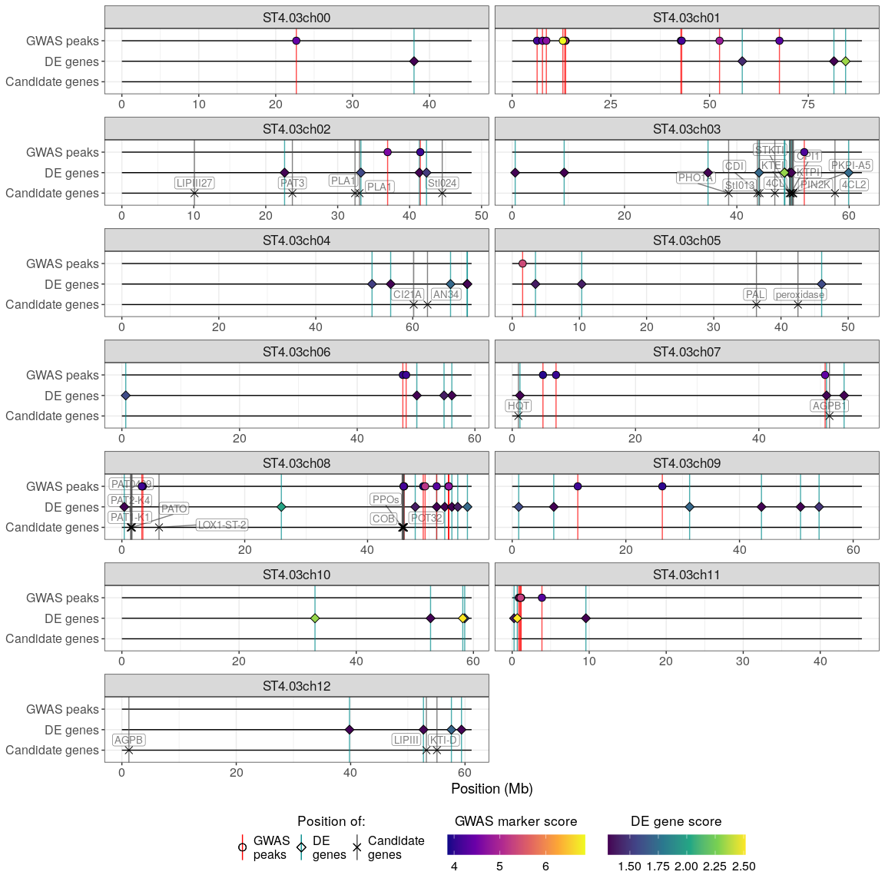

Transcriptomics differential expression
================
Olivia Angelin-Bonnet
December 14, 2022

``` r
theme_set(theme_bw())
theme_update(plot.title = element_text(hjust = 0.5),
             legend.position = "bottom",
             text = element_text(size = 16))
```

## Data path

``` r
read_count_filtered_path <- here("transcriptomics_differential_expression/processed_data/rna_seq_read_counts_raw_filtered.csv")
vst_count_filtered_path <- here("transcriptomics_differential_expression/processed_data/rna_seq_vst_filtered.csv")
rna_to_novogene <- here("data/RNA_to_Novogene.xlsx")
go_annot_path <- here("transcriptomics_differential_expression/processed_data/go_annot.csv")
descr_annot_path <- here("transcriptomics_differential_expression/processed_data/descr_annot.csv")

bruising_file <- here("data/raw_bruising_scores.csv")
samples_info_file <- here("data/samples_info.csv")

known_qtls_path <- here("data/known_qtls.tsv")
genotype_file <- here("genomics_data_preprocessing/processed_data/adegenet_input.csv")
gwas_peaks_path <- here("genomics_gwas/processed_data/gwas_peaks.csv")
```

## Reading the data

``` r
descr_annot = read_csv(descr_annot_path, show_col_types = FALSE)
```

``` r
counts_filtered_df = read_csv(read_count_filtered_path, show_col_types = FALSE)
samples_transcripto = names(counts_filtered_df[-1])
```

The samples sent for RNA sequencing correspond to one of the two
biological replicates of the genotypes, so we’ll map that and extract
the corresponding bruising mean score.

``` r
rna_info_df = read_xlsx(rna_to_novogene,
                        skip = 4,
                        col_names = c("sample_id",
                                      "group",
                                      "6prog",
                                      "cull_samp_no",
                                      "empty",
                                      "Rep",
                                      "concentration",
                                      "volume")) %>% 
  select(sample_id, group, Rep) %>% 
  filter(sample_id %in% samples_transcripto)
```

``` r
## Mean bruising scores
bruising_mean_df = read_csv(bruising_file, show_col_types = FALSE) %>% 
  select(Sample, Rep, starts_with("Bruise")) %>% 
  pivot_longer(cols = starts_with("Bruise"),
               names_to = "Bruise",
               values_to = "bruising_score") %>% 
  group_by(Sample, Rep) %>% 
  summarise(bruising_mean = mean(bruising_score, na.rm = TRUE), .groups = "drop") %>% 
  drop_na() %>% 
  mutate(SampleRep = paste0(Sample, "_Rep", Rep),
         group = case_when(bruising_mean <= 1 ~ "low",
                           bruising_mean >= 2 ~ "high",
                           TRUE ~ "medium")) %>% 
  select(Sample, SampleRep, Rep, bruising_mean, group)

write_csv(bruising_mean_df,
          here("transcriptomics_differential_expression/processed_data/bruising_mean_scores.csv"))
```

``` r
## keeping only the bruising info for the replicates that are used for the RNA sequencing
pheno_df = rna_info_df %>% 
  select(-group) %>% 
  left_join(bruising_mean_df, by = c("sample_id" = "Sample", "Rep" = "Rep")) 
```

## Grouping the samples

For this analysis we will use the bruising mean phenotype (i.e. mean of
bruising score over the 3 tubers for each sample) to separate the
samples in two groups. Samples with a bruising mean of 1 or less are
assigned to the “low” group, and samples with a bruising mean of 2 or
more are assigned to the “high” group.

``` r
conditions_df = pheno_df %>%
  filter(group %in% c("low", "high")) %>% 
  mutate(group = factor(group, levels = c("low", "high")))
```

## Differential expression analysis

We’re using the DESeq2 package for the differential expression analysis.

``` r
count_mat = as.matrix(counts_filtered_df[, -1])
rownames(count_mat) = counts_filtered_df$gene_id
colnames(count_mat) = samples_transcripto

count_mat = count_mat[, conditions_df$sample_id]
```

``` r
## making sure that the samples in the condition data-frame are in the same order as the columns of the counts matrix
conditions_df = as.data.frame(conditions_df)
rownames(conditions_df) = conditions_df$sample_id

all(conditions_df$sample_id == colnames(count_mat))
```

    ## [1] TRUE

``` r
## Creating a DESeqDataSet object
dds = DESeqDataSetFromMatrix(countData = count_mat,
                             colData = conditions_df,
                             design = ~ group)
```

    ## converting counts to integer mode

``` r
dds
```

    ## class: DESeqDataSet 
    ## dim: 25163 74 
    ## metadata(1): version
    ## assays(1): counts
    ## rownames(25163): PGSC0003DMG400013995 PGSC0003DMG400045238 ...
    ##   PGSC0003DMG400004272 PGSC0003DMG400004280
    ## rowData names(0):
    ## colnames(74): 2121_1 2121_3 ... 2183_4 2183_5
    ## colData names(5): sample_id Rep SampleRep bruising_mean group

``` r
## Performing the DE analysis
dds = DESeq(dds)
```

    ## estimating size factors

    ## estimating dispersions

    ## gene-wise dispersion estimates

    ## mean-dispersion relationship

    ## final dispersion estimates

    ## fitting model and testing

    ## -- replacing outliers and refitting for 237 genes
    ## -- DESeq argument 'minReplicatesForReplace' = 7 
    ## -- original counts are preserved in counts(dds)

    ## estimating dispersions

    ## fitting model and testing

``` r
res = results(dds, alpha = 0.05)
summary(res)
```

    ## 
    ## out of 25163 with nonzero total read count
    ## adjusted p-value < 0.05
    ## LFC > 0 (up)       : 30, 0.12%
    ## LFC < 0 (down)     : 27, 0.11%
    ## outliers [1]       : 0, 0%
    ## low counts [2]     : 3903, 16%
    ## (mean count < 3)
    ## [1] see 'cooksCutoff' argument of ?results
    ## [2] see 'independentFiltering' argument of ?results

We can compute the shrunken log2 fold-changes, which removes the noise
associated with the log2 fold-change of genes with low counts, without
requiring any arbitrary filtering threshold. This will be useful later
for visualisation.

``` r
## Computing the shrinkage of effect size
resLFC = lfcShrink(dds, coef="group_high_vs_low", type="apeglm")
```

    ## using 'apeglm' for LFC shrinkage. If used in published research, please cite:
    ##     Zhu, A., Ibrahim, J.G., Love, M.I. (2018) Heavy-tailed prior distributions for
    ##     sequence count data: removing the noise and preserving large differences.
    ##     Bioinformatics. https://doi.org/10.1093/bioinformatics/bty895

``` r
temp = as_tibble(resLFC, rownames = "gene") %>% 
  rename(log2FoldChange_shrinkage = log2FoldChange,
         lfcSE_shrinkage = lfcSE) %>% 
  select(gene, log2FoldChange_shrinkage, lfcSE_shrinkage)

de_res = as_tibble(res, rownames = "gene") %>% 
  left_join(temp, by = "gene")

write_csv(de_res, here("transcriptomics_differential_expression/processed_data/res_DE_LFCshrinkage.csv"))
```

## GO term enrichment

In this section, we’re using the gage package to perform an enrichment
analysis of the GO terms present in the dataset. We’ll only consider GO
terms related to biological processes or molecular function.

``` r
go_annot = read_csv(go_annot_path, show_col_types = FALSE)

go_info = go_annot %>% 
  select(go_id, name_1006, GO_domain) %>% 
  distinct() %>% 
  arrange(go_id)
```

``` r
## Get the GO terms for each GO domain
go_categories = lapply(unique(go_annot$GO_domain), function(i){
  unique(filter(go_annot, GO_domain == i)$go_id)
})
names(go_categories) = unique(go_annot$GO_domain)

## Get for each GO term the list of genes associated with the GO term
go_sets = lapply(c(go_categories[["Biological process"]], go_categories[["Molecular function"]]), function(i){
  filter(go_annot, go_id == i)$gene_id
})
names(go_sets) = c(go_categories[["Biological process"]], go_categories[["Molecular function"]])
```

``` r
gene_stats = res$padj
gene_stats[is.na(gene_stats)] = 1
gene_stats = -log10(gene_stats)
names(gene_stats) = rownames(resLFC)

gage_res = gage::gage(gene_stats, 
                      gsets = go_sets,
                      same.dir = FALSE, ## we don't want to see only coordinated changes
                      set.size = c(1, max(sapply(go_sets, length)) + 1))

go_sign_enr = as_tibble(gage_res$greater, rownames = "go_id") %>% 
  left_join(go_info, by = c("go_id")) %>% 
  select(go_id, q.val, name_1006, set.size, GO_domain) %>% 
  arrange(q.val) %>% 
  filter(q.val < 0.05)

go_sign_enr
```

    ## # A tibble: 6 × 5
    ##   go_id        q.val name_1006                                set.size GO_domain
    ##   <chr>        <dbl> <chr>                                       <dbl> <chr>    
    ## 1 GO:0005524 0.00600 ATP binding                                  2010 Molecula…
    ## 2 GO:0005515 0.00600 protein binding                              2578 Molecula…
    ## 3 GO:0006468 0.0136  protein phosphorylation                      1110 Biologic…
    ## 4 GO:0004672 0.0136  protein kinase activity                      1088 Molecula…
    ## 5 GO:0016740 0.0427  transferase activity                         1963 Molecula…
    ## 6 GO:0004674 0.0427  protein serine/threonine kinase activity      654 Molecula…

``` r
write_csv(go_sign_enr, 
          here("transcriptomics_differential_expression/processed_data/go_enrichment_signif.csv"))
```

## Description of differentially expressed genes.

The biomaRt package was used to query the Ensembl database in order to
obtain a name and a description for the genes. In addition, the genome
annotation file was used to extract the genomic position of the genes.
We’ll use this to get information about the DE genes.

``` r
de_genes_annotation = de_res %>% 
  left_join(descr_annot, by = c("gene" = "gene_id")) %>% 
  filter(padj < 0.05) %>% 
  select(gene, description, chrom, posmb, tx_start, tx_end, padj, log2FoldChange, transcript) %>% 
  arrange(chrom, posmb)

write_csv(de_genes_annotation, here("transcriptomics_differential_expression/processed_data/de_genes_annotation.csv"))
```

## Comparing differential expression with GWAS results

In this section, we will plot the genomic location of the markers with
high GWAS scores and the location of the genes found differentially
expressed.

``` r
df_genes = de_res %>% 
  filter(padj <= 0.05) %>% 
  select(gene, padj) %>% 
  mutate(score = -log10(padj)) %>% 
  left_join(descr_annot, by = c("gene" = "gene_id")) %>% 
  mutate(y = "DE genes") %>% 
  select(chrom, posmb, score, y) %>% 
  arrange(score)
```

``` r
df_gwas = read_csv(gwas_peaks_path, show_col_types = FALSE) %>% 
  mutate(posmb = pos * 1e-6,
         y = "GWAS peaks") %>% 
  select(chrom, posmb, score, y) %>% 
  arrange(score)
```

``` r
df_known = read_tsv(known_qtls_path, col_types = cols()) %>% 
  filter(Trait == "Bruising") %>% 
  mutate(posmb = (Start + End) / 2e6,
         y = "Candidate genes") %>% 
  rename(chrom = Chromosome) %>% 
  select(chrom, posmb, y, gene_name_short)

## For bruising - Keeping only 1 of the PPO genes to avoid clutering the figure
df_known$gene_name_short[which(df_known$gene_name_short == "PPO")[1]] = "PPOs"
df_known$gene_name_short[which(df_known$gene_name_short == "PPO")] = NA 
```

``` r
## Computing the size of the chromosomes using the genomics data
chroms_length = read_csv(genotype_file, show_col_types = FALSE) %>% 
  group_by(Chrom) %>% 
  summarise(length = max(Position)) %>%
  mutate(posmb = 0,
         posmb_end = length * 1e-6) %>% 
  rename(chrom = Chrom)

toplot_frame = bind_rows(
  chroms_length %>% 
    mutate(y = "GWAS peaks"),
    chroms_length %>% 
    mutate(y = "DE genes"),
    chroms_length %>% 
    mutate(y = "Candidate genes")
)
```

``` r
shapes_y = c("Candidate genes" = 4,
             "DE genes" = 23,
             "GWAS peaks" = 21)

colours_y = c("Candidate genes" = "gray30",
              "DE genes" = "darkcyan",
              "GWAS peaks" = "red")

labels_y = c("Candidate genes" = "Candidate\ngenes",
             "DE genes" = "DE\ngenes",
             "GWAS peaks" = "GWAS\npeaks")
```

``` r
p = bind_rows(
  df_genes,
  df_gwas,
  df_known
) %>% 
  ggplot(aes(x = posmb, y = y)) + 
  geom_segment(data = toplot_frame, aes(xend = posmb_end, yend = y)) +
  facet_wrap(~chrom, scales = "free_x", ncol = 2) +
  geom_label_repel(aes(label = gene_name_short), nudge_y = 0.5, na.rm = TRUE, size = 3.5, label.padding = 0.15, alpha = 0.5) +
  geom_vline(aes(xintercept = posmb, colour = y), alpha = 0.7) +
  geom_point(data = df_gwas, mapping = aes(shape = y, fill = score), size = 3) +
  geom_point(data = df_known, mapping = aes(shape = y), size = 3) +
  scale_colour_manual(values = colours_y, labels = labels_y, breaks = rev(names(labels_y))) +
  scale_shape_manual(values = shapes_y, labels = labels_y, breaks = rev(names(labels_y))) +
  scale_fill_viridis_c("GWAS marker score", 
                       option = "plasma",
                       guide = guide_colourbar(title.position="top", 
                                               title.hjust = 0.5, 
                                               barwidth = unit(4.75, "cm"), 
                                               barheight = unit(0.7, "cm"),
                                               order = 2)) +
  guides(colour = guide_legend(title.position = "top", 
                               title.hjust = 0.5, 
                               override.aes = list(alpha = 1),
                               order = 1),
         shape = guide_legend(order = 1)) +
  new_scale_fill() + 
  geom_point(data = df_genes, mapping = aes(shape = y, fill = score), size = 3) +
  scale_fill_viridis_c("DE gene score", 
                       option = "viridis", 
                       guide = guide_colourbar(title.position="top", 
                                               title.hjust = 0.5, 
                                               barwidth = unit(4.75, "cm"), 
                                               barheight = unit(0.7, "cm"),
                                               order = 3))   +
  labs(x = "Position (Mb)",
       y = NULL,
       shape = "Position of:",
       colour = "Position of:")

p + theme(legend.position = "bottom",
          legend.direction = "horizontal",
          legend.box = "horizontal",
          legend.key.size = unit(0, 'lines'),
          axis.title = element_text(size = 14),
          axis.text = element_text(size = 12),
          legend.title = element_text(size = 13),
          legend.text = element_text(size = 12))
```



``` r
p2 = p + theme(legend.position = c(0.75, 0.05),
               legend.direction = "horizontal",
               legend.box = "horizontal",
               legend.key.size = unit(0, 'lines'),
               axis.title = element_text(size = 14),
               axis.text = element_text(size = 12),
               legend.title = element_text(size = 13),
               legend.text = element_text(size = 12))

ggsave(here("transcriptomics_differential_expression/processed_data/gwas_de_plot.pdf"),
       plot = p2, 
       width = 1.5 * 11.75,
       height = 1.3 * 8.25)
ggsave(here("transcriptomics_differential_expression/processed_data/gwas_de_plot.png"), 
       plot = p2, 
       width = 1.5 * 11.75, 
       height = 1.3 * 8.25)
```
